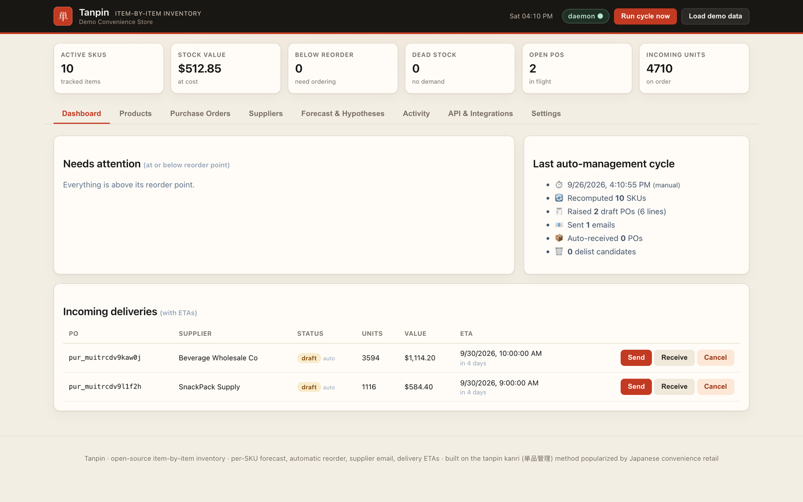
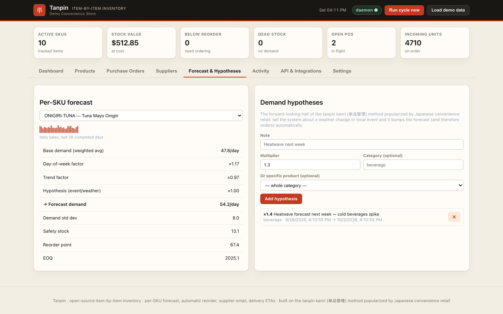
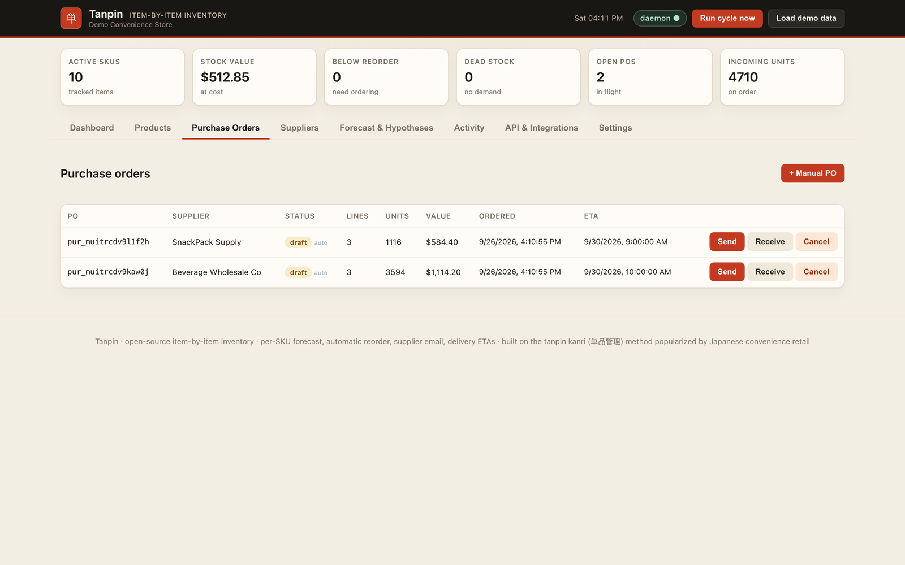

# Tanpin

**Item-by-item inventory that reorders itself.** Per-SKU demand forecasts, automatic purchase orders, supplier email and delivery ETAs — with a REST API, an MCP server, a daemon, and a dashboard. Pure Node 22, zero runtime dependencies (`node:*` built-ins only).



<sub>Real screenshot of the demo; the data in it is invented sample data.</sub>

<table><tr><td width="50%"><br><sub>Per-SKU forecast with weekday and trend factors, safety stock, reorder point and a manager hypothesis.</sub></td><td width="50%"><br><sub>Purchase orders the cycle raised, grouped by supplier.</sub></td></tr></table>

## Why tanpin kanri

Tanpin kanri (単品管理, “single-item management”) treats every SKU as its own business. A store manager forms a hypothesis about tomorrow’s demand for that item — weather, a local event, day of week — orders against it, then verifies the result against actual sales. High-velocity items get tight control and frequent replenishment. The long tail gets simpler rules, and is the first to be delisted.

Tanpin encodes that loop in software:

1. **Forecast each SKU** from recent sales, weekday seasonality, short-term trend, and manager-entered hypotheses (events, weather, promotions).
2. **Compute the order** — safety stock at a chosen service level, reorder point, EOQ, pack-size rounding, minimum order quantity, and a JIT cap on days of supply.
3. **Buy and track** — purchase orders grouped by supplier, emailed automatically, with a delivery ETA from lead time, cut-off hour, and delivery windows.
4. **Stop stocking what does not sell** — dead and slow SKUs are flagged to delist.

ABC classification follows the same idea: a small set of A items drives most value and gets the freshest reorder cadence; C items are the delist pool.

## Features

- **Per-SKU forecasting** — recency-weighted moving average, day-of-week factors, trend (±40%), compounding hypotheses
- **Automatic reorder** — safety stock, reorder point, EOQ, pack size, MOQ, max days of supply
- **ABC + delist** — A/B/C by revenue contribution; dead (no demand) and slow (too many days of supply) flags
- **Daemon** — every N minutes (default 15): re-forecast, reclassify, raise draft POs, optionally email and auto-receive
- **Supplier email** — SMTP over implicit TLS (port 465) when `SMTP_HOST` is set; otherwise `.eml` files in the outbox
- **Delivery ETAs** — lead time snapped to the next delivery window, honoring cut-off hours (UTC today)
- **REST API** — products addressed by SKU, OpenAPI 3.1 at `/openapi.json`, agent guide at `/llms.txt`
- **MCP server** — newline-delimited JSON-RPC over stdio for Claude Code, Codex, Cursor, and any MCP client
- **Dashboard** — vanilla JS SPA at `/` (products, orders, suppliers, forecast, activity, API, settings)
- **Webhooks** — HMAC-SHA256 signed JSON POSTs (`X-Inventory-Signature`)
- **CSV** — import/export products; export the movement audit trail
- **API keys** — stored as SHA-256 hashes, full key shown once
- **Idempotency-Key** — 24h replay window on sales and purchase-order writes
- **Plugins** — `TANPIN_PLUGIN` loads extra HTTP routes and usage limits
- **Storage** — SQLite (`node:sqlite`, WAL, incremental row writes; `data/inventory.sqlite`) shared safely by the server and a standalone daemon; JSON fallback with `TANPIN_STORE=json`

## 60-second quickstart

Requires [Node.js 22](https://nodejs.org/) or newer.

```bash
npx github:willykeenan/tanpin serve
```

Open [http://localhost:4173](http://localhost:4173) and click **Load demo data**. That loads a convenience-store catalog, about 35 days of sales, live forecasts, and reorder recommendations.

From a clone of this repo:

```bash
node bin/tanpin serve
```

### Docker

Public demo image (the Hugging Face Space):

```bash
docker build -f space/Dockerfile -t tanpin-demo .
docker run --rm -p 7860:7860 tanpin-demo
```

Open [http://localhost:7860](http://localhost:7860). The image runs `DEMO_MODE=1 PORT=7860 HOST=0.0.0.0 node bin/tanpin serve`: reads are open, writes are limited to the demo catalog (sales, adjustments, POs, hypotheses, seed, cycles) and need no key, webhooks and SMTP are off, and the catalog reseeds every 30 minutes.

Self-hosted image (root `Dockerfile` / `compose.yml`): requests reach the container through Docker's port mapping, so they are not "this machine" and every API call needs a key. Start it with a master key and paste that key into the dashboard's prompt:

```bash
docker build -t tanpin .
docker run --rm -p 4173:4173 -e TANPIN_ADMIN_KEY="$(openssl rand -hex 24)" -v tanpin-data:/app/data tanpin
# or: echo "TANPIN_ADMIN_KEY=$(openssl rand -hex 24)" > .env && docker compose up
```

More detail, including the first sale and first purchase order: [docs/QUICKSTART.md](docs/QUICKSTART.md).

## API

Send `Authorization: Bearer <key>` or `X-API-Key: <key>`. Requests made on the server's own machine straight to `localhost` need no key by default; anything through a reverse proxy, a container port mapping, or another browser origin does (see [Security model](#security-model)).

Five calls that cover the store:

```bash
# Whole world in one response: KPIs, products with live math, open POs, suppliers
curl http://localhost:4173/api/state

# Record a sale (SKU everywhere; Idempotency-Key for safe retries)
curl -X POST http://localhost:4173/api/sales \
  -H 'Content-Type: application/json' \
  -d '{"sku":"COFFEE-HOT","qty":2}'

# Dry run of the ordering engine, grouped by supplier
curl http://localhost:4173/api/recommendations

# Turn a recommendation into a real PO (and email it)
curl -X POST http://localhost:4173/api/purchase-orders \
  -H 'Content-Type: application/json' \
  -d '{"supplierId":"FreshFoods Distribution","fromRecommendations":true,"autoSend":true}'

# Forward-looking demand bump — forecasts and auto-orders adjust immediately
curl -X POST http://localhost:4173/api/hypotheses \
  -H 'Content-Type: application/json' \
  -d '{"note":"heatwave next week","multiplier":1.4,"category":"beverage"}'
```

Errors are `{"error":"<message>","code":"<machine_code>"}`. `/api/...` and `/api/v1/...` are equivalent.

Full reference: [docs/API.md](docs/API.md). Live contract: `GET /openapi.json`. Agent-oriented guide: `GET /llms.txt`.

## MCP

Start the inventory server, then point an MCP client at `tanpin mcp`. The process speaks JSON-RPC on stdio and calls the HTTP API.

Environment: `INVENTORY_URL` (default `http://localhost:4173`), `INVENTORY_API_KEY` when the server requires a key.

### Claude Code

```bash
claude mcp add tanpin --env INVENTORY_URL=http://localhost:4173 -- npx -y github:willykeenan/tanpin mcp
```

Or a project `.mcp.json`:

```json
{
  "mcpServers": {
    "tanpin": {
      "command": "npx",
      "args": ["-y", "github:willykeenan/tanpin", "mcp"],
      "env": {
        "INVENTORY_URL": "http://localhost:4173"
      }
    }
  }
}
```

From a local checkout, use `"command": "node"` and `"args": ["src/mcp.js"]` (or `["bin/tanpin", "mcp"]`) instead of `npx`.

### Codex

In `~/.codex/config.toml` (or the project Codex config):

```toml
[mcp_servers.tanpin]
command = "npx"
args = ["-y", "github:willykeenan/tanpin", "mcp"]

[mcp_servers.tanpin.env]
INVENTORY_URL = "http://localhost:4173"
```

### Cursor

`.cursor/mcp.json`:

```json
{
  "mcpServers": {
    "tanpin": {
      "command": "npx",
      "args": ["-y", "github:willykeenan/tanpin", "mcp"],
      "env": {
        "INVENTORY_URL": "http://localhost:4173"
      }
    }
  }
}
```

Call `get_overview` first. Typical flow: `get_overview` → `get_reorder_recommendations` → `create_purchase_order` with `from_recommendations=true`.

Tool list and schemas: [docs/MCP.md](docs/MCP.md).

## Security model

- **Only direct local requests skip the key.** A request needs no key only when the TCP peer is loopback, the `Host` header is a loopback name (`localhost`, `127.x`, `::1`), and there is no forwarding header (`Forwarded`, `X-Forwarded-*`, `X-Real-IP`, `Via`, ...). A reverse proxy on the same host (nginx, Caddy, cloudflared) therefore does not turn the internet into "localhost". Set `TANPIN_REQUIRE_API_KEY=1` to require a key on every request. Anywhere a key is needed, the dashboard asks for one.
- **Cross-origin browser requests** (reads and writes, including `TANPIN_CORS_ORIGINS` origins) always need a key.
- **Secrets are write-only.** Webhook signing secrets and provider credentials in `settings.integrations` are never returned by reads (`hasWebhookSecret: true` instead); a webhook's secret is shown once, when it is created.
- **API keys** are created with `POST /api/keys`. The plaintext key appears in that response once; the store keeps a SHA-256 hash and a visible prefix. Send the key as `Authorization: Bearer <key>` or `X-API-Key: <key>`. Revoke with `DELETE /api/keys/{id}`.
- **Master key.** `TANPIN_ADMIN_KEY` is an always-valid key compared with a timing-safe hash. Use it for bootstrap, then issue hashed keys.
- **Webhooks** are JSON POSTs signed with `X-Inventory-Signature: sha256=<HMAC-SHA256(secret, raw_body)>`. Verify the signature against the raw bytes. Deliveries are fire-and-forget (10s timeout) so a dead receiver cannot break a sale or a daemon cycle. They never go to private, loopback, link-local, CGNAT or reserved addresses (checked on the address actually connected to, so DNS rebinding does not help), never follow redirects, and are off in `DEMO_MODE` — in the server and the standalone daemon alike.
- **Idempotency.** `Idempotency-Key` on `POST /api/sales`, `/api/sales/bulk`, and `/api/purchase-orders` replays the original response for 24 hours.
- **Input hygiene.** JSON bodies drop `__proto__` / `constructor` / `prototype` keys. Static files are confined to `public/`.
- **Email.** SMTP is implicit TLS on port 465 (`SMTP_HOST`, `SMTP_PORT`, `SMTP_USER`, `SMTP_PASS`). With no SMTP config, mail is written under the data directory as `.eml` files and recorded in `GET /api/outbox`.
- **CORS** is an allowlist (`TANPIN_CORS_ORIGINS`); `*` is never sent. The server binds `127.0.0.1` unless `HOST` says otherwise. Every response carries a Content-Security-Policy without inline script.

Before exposing the port, set `TANPIN_ADMIN_KEY` (or create keys from localhost). Details: [docs/SECURITY-MODEL.md](docs/SECURITY-MODEL.md).

## CLI

```
tanpin serve    API + dashboard (PORT, HOST, TANPIN_DATA_DIR / TANPIN_DB)
tanpin daemon   auto-management loop against the same data file (same TANPIN_* env as serve)
tanpin mcp      MCP server on stdio (INVENTORY_URL, INVENTORY_API_KEY)
tanpin seed     replace the data file with the demo store
```

`tanpin serve` starts the daemon in-process unless `TANPIN_NO_DAEMON=1`.

## Configuration

| Variable | Used by | Default |
|---|---|---|
| `PORT` | serve | `4173` |
| `HOST` | serve | `127.0.0.1` |
| `TANPIN_DATA_DIR` | serve, daemon, seed | `./data` |
| `TANPIN_DB` | serve, daemon, seed | `$TANPIN_DATA_DIR/inventory.json` (stored as `inventory.sqlite`) |
| `TANPIN_OUTBOX` | serve, daemon | `<dir of TANPIN_DB>/outbox` |
| `TANPIN_REQUIRE_API_KEY` | serve | unset (direct local requests open) |
| `TANPIN_ADMIN_KEY` | serve | unset |
| `TANPIN_NO_DAEMON` | serve | unset (daemon on) |
| `TANPIN_PLUGIN` | serve | unset |
| `TANPIN_CORS_ORIGINS` | serve | unset (same-origin only) |
| `DEMO_MODE` | serve, daemon | unset; the Space image sets `1` |
| `INVENTORY_URL` | mcp | `http://localhost:4173` |
| `INVENTORY_API_KEY` | mcp | unset |
| `INVENTORY_DB` | legacy alias of `TANPIN_DB` | unset |
| `STRIPE_API_KEY` / `SQUARE_ACCESS_TOKEN` | sales integrations | unset (see [docs/INTEGRATIONS.md](docs/INTEGRATIONS.md)) |
| `SMTP_HOST` / `SMTP_PORT` / `SMTP_USER` / `SMTP_PASS` | email | outbox files if `SMTP_HOST` is unset |

Runtime state lives in `data/` and `outbox/` (gitignored). Settings such as `autoManage`, `autoSend`, `autoReceive`, `serviceLevel`, `timezone`, and `daemonIntervalMinutes` are stored with the data and edited via `PUT /api/settings` or the Settings tab.

## Roadmap

**Ships in 0.1.0**

- Forecast, reorder math, daemon, REST, MCP, dashboard, webhooks, CSV, API keys, SMTP/outbox, plugin hook
- **Security** — bind `127.0.0.1` by default; CORS allowlist (`TANPIN_CORS_ORIGINS`); Origin/Host checks; proxy-aware local bypass; masked secrets; webhook SSRF guard with DNS pinning; CSP; `DEMO_MODE=1` for the public Space
- **SQLite storage** — `node:sqlite` default backend, WAL, incremental writes, cross-process stock deltas; JSON fallback via `TANPIN_STORE=json`
- **Integrations** — inbound Stripe Checkout / Shopify / Square order webhooks (line items fetched from the provider API where the webhook omits them), CSV sales, extra email transports
- **Backtest** — `GET /api/backtest` rolling-origin forecast evaluation (MAPE, sMAPE, bias), run on a worker thread
- **Timezone** — IANA store timezone (`settings.timezone`) for calendar days, forecasts, delivery windows, cut-offs and CSV dates

## Develop

```bash
npm test          # node --test --test-concurrency=1 test/
```

See [CONTRIBUTING.md](CONTRIBUTING.md). MIT license — [LICENSE](LICENSE).

